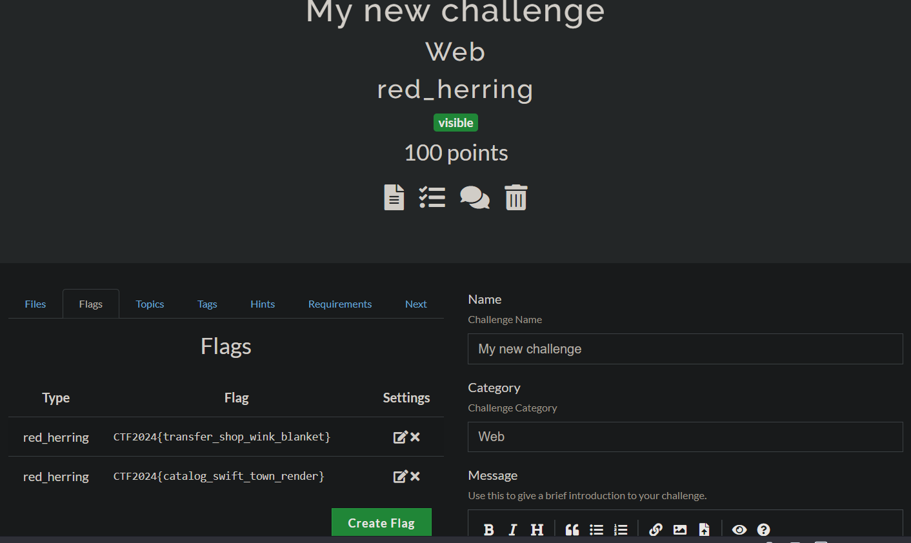

# CTFd - Red Herring Plugin

## Introduction

The Red Herring plugin is an extension for the CTFd platform, designed to provide a new type of challenge that promotes fairness and prevents flag sharing among participating teams. This user manual will guide you through the steps of using the Red Herring plugin effectively.

## Table of Contents

1. Installation
2. Creating Red Herring Challenges
3. Managing Teams and Containers
4. Monitoring Cheating Attempts
5. Troubleshooting
6. Support and Feedback

## 1. Installation

To use the Red Herring Challenges plugin, follow these steps:

1. Clone or download the plugin repository from [GitHub](https://github.com/Isotech42/CTFd-RedHerring).
2. Navigate to the CTFd installation directory on your server.
3. Copy the downloaded plugin folder into the CTFd plugins directory.
4. Modify the variables in the [`globals.py`](globals.py) file to suit your needs, as the flag prefix or words language, the IP address of the Docker host and the starting port that will be exposed and used by the Docker service.
5. Restart the CTFd application.

**WARNING**

The plugin was developed and tested on a local machine running the CTFd application locally with a Docker service running on the same machine. It is not guaranteed to work on a dockerized version of CTFd or with a Docker service running on a remote server (specifically the creation of the Docker containers for each team).

## 2. Creating Red Herring Challenges

To create a Red Herring challenge, follow these steps:

1. Log in to the CTFd admin panel.
2. Click on the "Create Challenge" button.
3. Select "red_herring" as the challenge type.
4. Provide the necessary challenge details, such as the title, description, and points.

5. Specify the Dockerfile content for the challenge in the dedicated "Dockerfile" field.

6. Click on the "Create Challenge" button to create the challenge.

The plugin will automatically generate a unique flag for each participating team, ensuring that each team receives a different flag for the same challenge and creating a unique Docker container for each team.

If it's the first time to build your image in Docker, the plugin may take a few seconds to minutes to build the Docker image and create the Docker container for each team.

When a user goes in the challenges page and click on a Red Herring challenge, the plugin will show the address of the Docker container associated with the team and the port exposed by the container.

**CAUTION**

Because the flag is provided to the container as an environment variable, your challenge must not allow competitors to read the environment variables via command execution or by reading /proc/<pid>/environ.
Verify that Docker is running on your server and that the Docker service is accessible to the CTFd application.

## 3. Team Creation

The Red Herring plugin dynamically creates Docker containers for each team participating in a challenge. The containers provide an isolated environment for teams to attempt the challenge without interfering with other teams.

When you create a new team in CTFd, the plugin will automatically generate a unique flag for each existing Red Herring challenge. It will also create a dedicated Docker container for the team associated with each challenge.
The different flags for each challenge are stored in the CTFd database that you can access via the admin panel in the section "Flags" under your challenge.

## 4. Monitoring Cheating Attempts

The Red Herring plugin includes a "Cheat Monitor" feature to detect cheating attempts during the competition. The Cheat Monitor provides an easy way to visualize and identify any cheating attempts detected by the plugin.

To access the Cheat Monitor:

1. Visit the URL corresponding to the Cheat Monitor in the upper right corner of the CTFd admin panel, under the "Plugins" section.
2. The Cheat Monitor will display a table with information about teams that shared flags, including the team IDs, the challenge involved, the team attempting to cheat, the team receiving the shared flag, the shared flag content, and the incident date.

## 5. Troubleshooting

If you encounter any issues while using the Red Herring Challenges plugin, consider the following troubleshooting tips:

1. Ensure that you have properly installed the plugin and restarted the CTFd application.
2. Verify that the Docker service is running on your server.
3. Check the CTFd logs for any error messages related to the plugin.

Feel free to change the Python code to suit your needs or if you manage to fix any bugs.

## 6. Support and Feedback

This plugin was created in the context of my Bachelor's work and has surely some bugs or can be improved.
For any questions, support, or feedback regarding the Red Herring plugin, please contact me at [isotech42@gmail.com](mailto:isotech42@gmail.com). I welcome your input and suggestions to improve the plugin and make hacking competitions more engaging and fair for all participants.

## 7. References

[1] [CTFd Plugin Docs](https://docs.ctfd.io/docs/plugins/overview) : For all information about CTFd plugins and how to use them.

[2] [CTFdOnlineChallenge](https://github.com/XuCcc/CTFdOnlineChallenge) : For his great work on the CTFdOnlineChallenge plugin, which inspired me to create this plugin and provided a great starting point for my work.

[3] [Docker SDK for Python](https://docker-py.readthedocs.io/en/stable/) : For the documentation of the Docker SDK for Python, which I used to create the Docker containers for the Red Herring challenges.

[4] [Docker Documentation](https://docs.docker.com/) : For the documentation of Docker, which I also used to create the Docker containers for the Red Herring Challenges.

---
Thank you for using the Red Herring plugin ! I hope it enhances your CTF experience and ensures an exciting and equitable competition environment. Happy hacking!